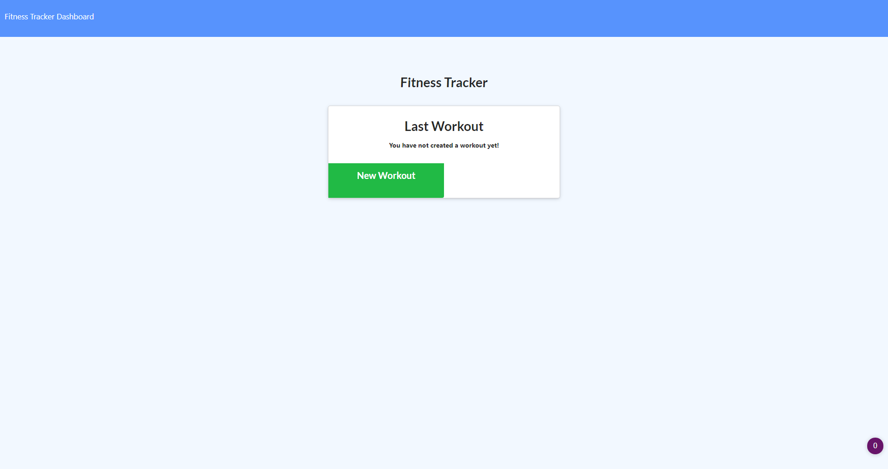
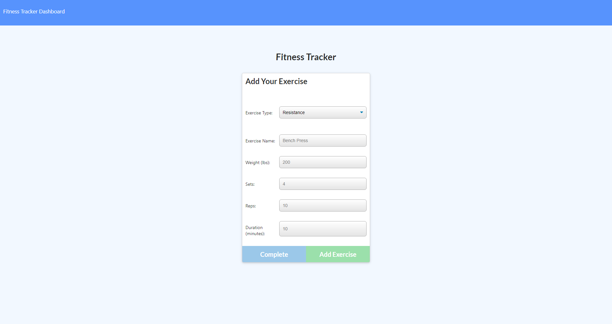
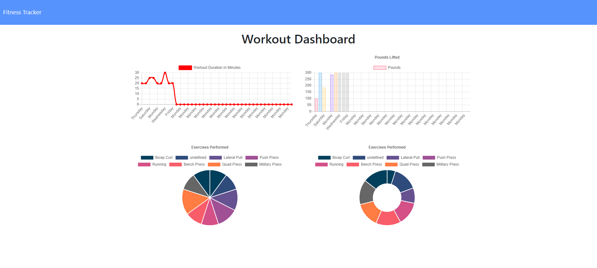

# nosql-workout-tracker

## Description 

The purpose of this application is to create a workout tracker using mongoose along side the noSQL mongo database and Express.

The webpage is hosted on [Heroku](https://secure-spire-89187.herokuapp.com/).

You can find the repo on [GitHub](https://github.com/Rconat/nosql-workout-tracker).

## Table of Contents

* [List of Files](#List-of-Files)
* [Usage](#usage)
* [Credits](#credits)

## List of Files

<ul>
    <li>server.js</li>
    <li>package.json</li>
    <li>package-lock.json</li>
    <li>README.md</li>
    <li>seed.js</li>
    <li>api.js</li>
    <li>exercise.html</li>
    <li>exercise.js</li>
    <li>index.html</li>
    <li>index.js</li>
    <li>stats.html</li>
    <li>stats.js</li>
    <li>style.css</li>
    <li>workout.js</li>
    <li>Exercise.js</li>
    <li>index.js</li>
    <li>Workout.js</li>
    <li>main.png</li>

</ul>

## Usage 

This application lets a user track their workouts and display the progress in graphs. The user will enter data that will be stored in the mongo database to be used by the applicaton. The user will choose either a "resistance" workout or a "cardio" workout. If the user selects resistance they will enter the exercise name, weight, sets, reps, and duration. Once the user inputs they can hit the "Add Exercise" button and the data will be saved to the server. If the user selects "cardio" they will enter the name, distance, and duration which will then be stored in the server. Upon hitting the dashboard button the user will be sent to the stats page which will display necessary previous workout stats for the user. 

## Credits

Working alongside professors and TAs through Trinity and Northwestern Coding Bootcamp to provide the file structure and directories as well as the assignment parameters. For this assignment the front end code was provided.

---

